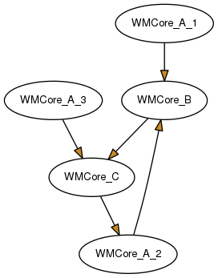
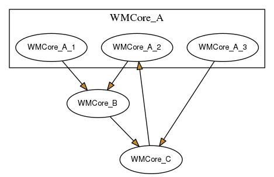
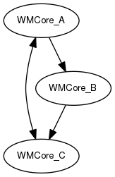

# pydeps-parse

Scripts to parse, edit and draw simplified versions of dependency diagrams obtained with pydeps

### Example

Run the script on a simplified diagram to have a graps of its effects.

The input diagram dot file is a description of the 
dependency diagram. `A -> B` means
`B.py` has the line `import A`.

```
digraph G {
  concentrate = true;

  rankdir = TB;
  node [style=filled,fillcolor="#ffffff",fontcolor="#000000",fontname=Helvetica,fontsize=10];

  WMCore_A_1 -> WMCore_B  [fillcolor="#c88b23"]
  WMCore_A_2 -> WMCore_B [fillcolor="#c88b23"]
  WMCore_A_3 -> WMCore_C [fillcolor="#c88b23"]
  WMCore_B -> WMCore_C [fillcolor="#c88b23"]
  WMCore_C -> WMCore_A_2 [fillcolor="#c88b23"]
}
```

(The structure of this file resembles the one that `pydeps` produces at output.
Some characteristics are hardcoded in the script. If you use a different 
structure the script may break)

The image produced from this dot file is 



We want to simplify this graph grouping at the second level, i.e.
have only nodes of of the form `WMCore_X` and nothing deeper.
So, we want to merge the nodes `WMCore_A_N` together and consider the arrow 
to and from `WMCore_A_N` as if they are originating from and to `WMCore_A`. 
The grouping could be represented like 

 

We run the script with `-l 2` to specify at we want to merge the nodes 
at the `WMCore_X` level.

```python
python3 pydeps-parse.py \
      -i ./example/example.dot \
      -l 2
```

This produces two ouput files, one of which is the dot 
file of the simplified dependency graph. Note the double-sided arrow from 
`WMCore_A` to `WMCore_C` and vice versa.

.


The other file is the dump of the internal data structure and is used for 
debugging purposes only.
